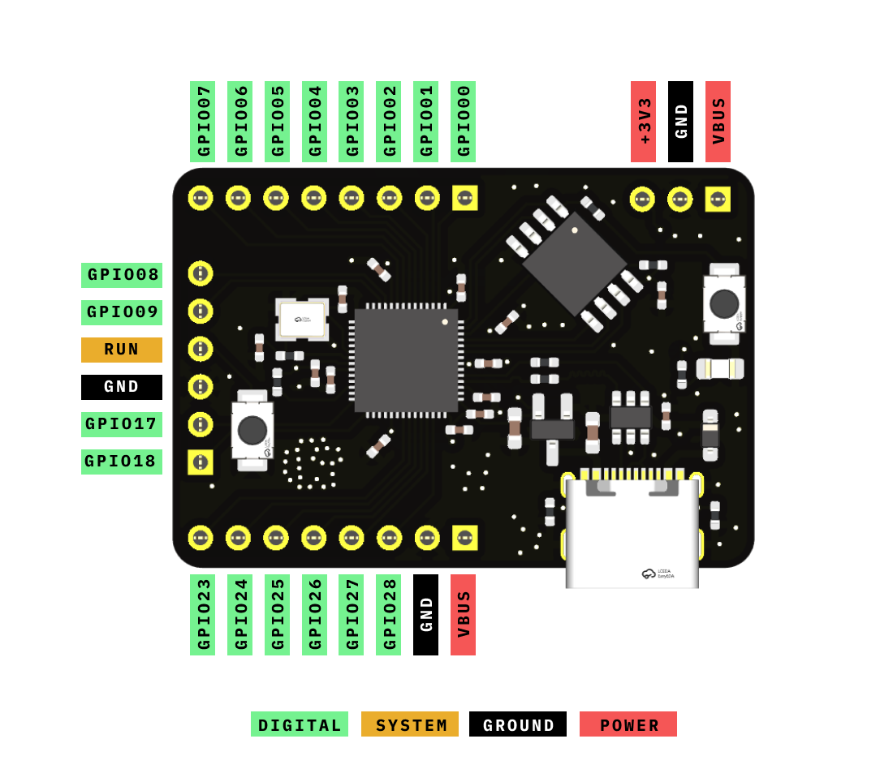

# Taranium-RP2040

An RP2040 devboard that is made to be compact and have its pins horizontally rather than vertically so it can have better packaging for my projects. Specifically this was made for my [driving macropad](https://github.com/Taran-the-Idiot/carpad) because the original microcontroller I was using did not have enough pins and all the alternatives took up a large amount of vertical space and would not package well

This board has the following features:

- USBc Port as USBc is superior
- 8MB Flash
- 25 pins
- 18 GPIO pins
- A Reset button

Anyways onwards to the next part

## Pinout

Here is the pinout diagram for this board.

There are 25 pins in total.

- 18 GPIO
- 3 GND
- 2 VBUS
- 1 +3V3
- 1 RUN

## Schematic

Here is the schematic for the board.

## PCB

### PCB Top Side

### PCB Bottom Side

### Silkscreen

## Symbol/Footprint

A Kicad Symbol and Footprint for this board can be found in the [kicad](kicad/) folder.

Currently there is no plan to include footprints and symbols for other software.

## BOM

|Item|Source|Price($USD)|
|----|------|-----|
|PCB|JLCPCB|3.04|
|PCBa|JLCPCB|45.24|
|JLC Shipping|JLCPCB|1.5|
|Headers|[aliexpress](https://www.aliexpress.com/item/4000988113226.html?algo_pvid=bc2dc20b-ab48-4370-b92b-af39fdf054ba&algo_exp_id=bc2dc20b-ab48-4370-b92b-af39fdf054ba-6&pdp_ext_f=%7B%22order%22%3A%228387%22%2C%22eval%22%3A%221%22%2C%22fromPage%22%3A%22search%22%7D&pdp_npi=6%40dis%21AUD%211.84%211.39%21%21%211.31%210.99%21%4021033d9d17786630634743789ec4a9%2110000013202368848%21sea%21AU%210%21ABX%211%210%21n_tag%3A-29910%3Bd%3Ac34077ee%3Bm03_new_user%3A-29895%3BpisId%3A5000000203295501&curPageLogUid=Habg8k26UfcJ&utparam-url=scene%3Asearch%7Cquery_from%3A%7Cx_object_id%3A4000988113226%7C_p_origin_prod%3A)|1.6|
||Total|51.38|

